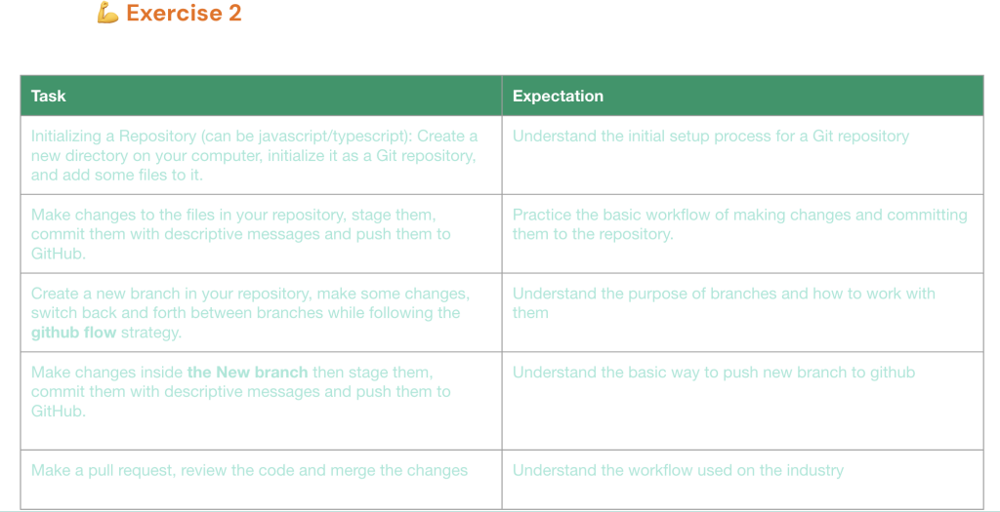
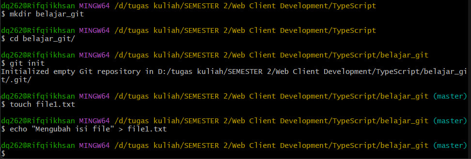
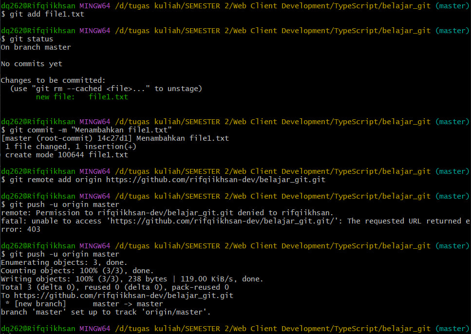
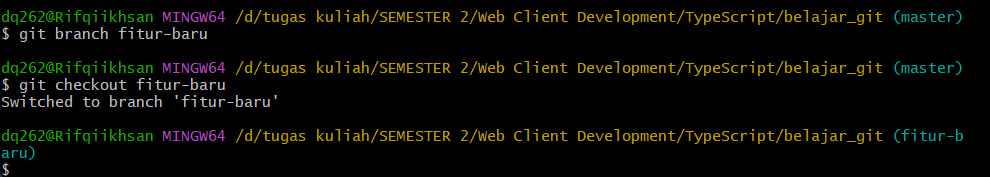
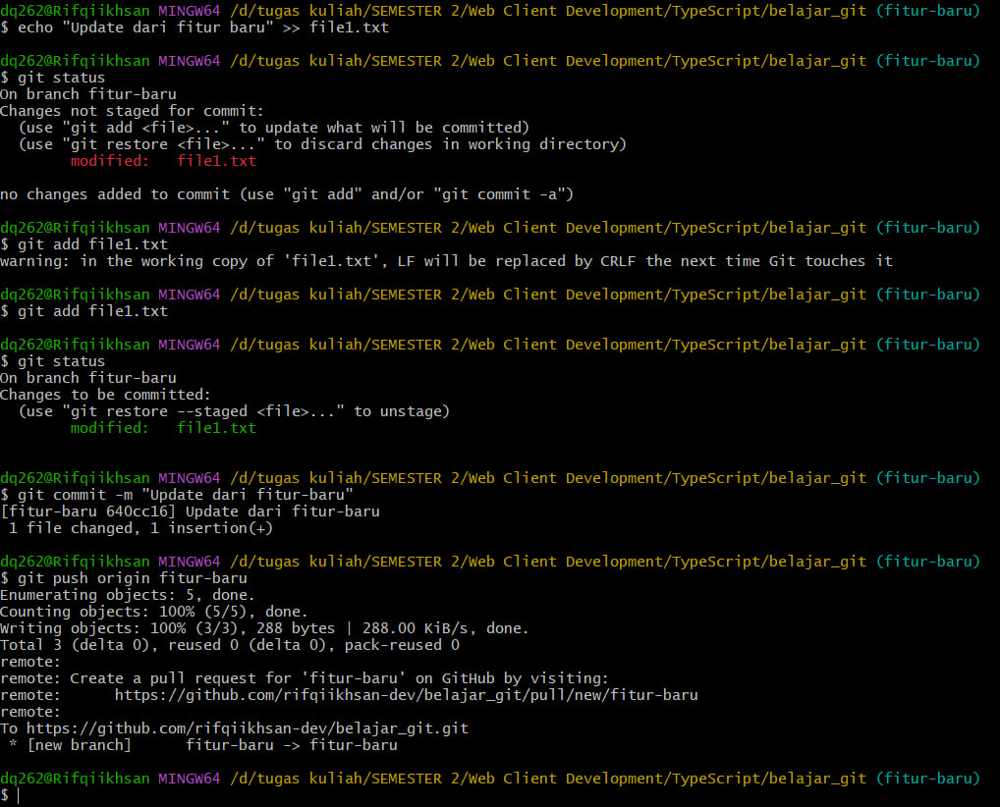
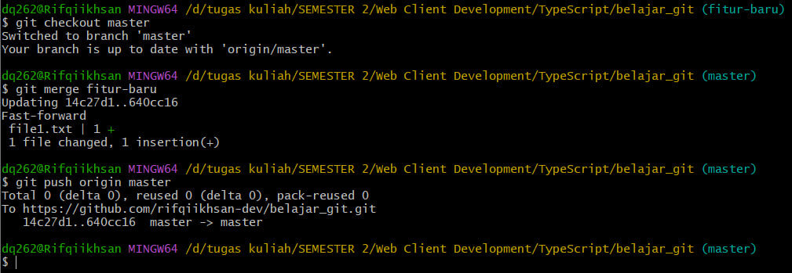

# 🚀 Latihan Git & GitHub

Repositori ini berisi latihan dasar dalam penggunaan **Git dan GitHub** untuk memahami alur kerja pengelolaan kode versi.

## 📌 Daftar Tugas



### 1️⃣ Inisialisasi Repository

#### 🔹 Langkah-langkah:

1. Buat direktori baru dan masuk ke dalamnya.
2. Inisialisasi sebagai repository Git.
3. Tambahkan file baru.

#### 📝 Perintah:

```bash
mkdir nama_proyek                # Buat direktori baru
cd nama_proyek                   # Masuk ke dalam direktori
git init                         # Inisialisasi repository Git
touch file1.txt                  # Buat file contoh
echo "Hello Git" > file1.txt     # Tambahkan isi ke file
```

🖼 **Screenshot:**


---

### 2️⃣ Melakukan Perubahan dan Commit

#### 🔹 Langkah-langkah:

1. Lakukan perubahan pada file.
2. Tambahkan perubahan ke staging.
3. Commit dengan pesan deskriptif.
4. Push ke GitHub.

#### 📝 Perintah:

```bash
git add file1.txt                          # Menambahkan file ke staging
git commit -m "Menambahkan file1.txt"      # Commit dengan pesan deskriptif
git remote add origin <URL_REPO_GITHUB>    # Hubungkan ke repository GitHub
git push -u origin main                    # Push ke repository GitHub
```

🖼 **Screenshot:**


---

### 3️⃣ Membuat dan Berpindah Branch

#### 🔹 Langkah-langkah:

1. Buat branch baru.
2. Berpindah ke branch tersebut.
3. Ikuti strategi GitHub Flow.

#### 📝 Perintah:

```bash
git branch fitur-baru          # Buat branch baru
git checkout fitur-baru        # Beralih ke branch baru

# atau bisa langsung dengan:
git checkout -b fitur-baru
```

🖼 **Screenshot:**


---

### 4️⃣ Push Branch Baru ke GitHub

#### 🔹 Langkah-langkah:

1. Lakukan perubahan dalam branch baru.
2. Commit dan push perubahan ke GitHub.

#### 📝 Perintah:

```bash
echo "Update dari fitur-baru" >> file1.txt  # Lakukan perubahan
git add file1.txt                           # Menambahkan file ke staging
git commit -m "Update dari fitur-baru"      # Commit dengan pesan deskriptif
git push origin fitur-baru                  # Push branch baru ke GitHub
```

🖼 **Screenshot:**


---

### 5️⃣ Membuat Pull Request dan Menggabungkan Perubahan

#### 🔹 Langkah-langkah:

1. Buka GitHub, pilih tab **Pull Requests**.
2. Klik **New Pull Request**, pilih branch `fitur-baru`.
3. Buat Pull Request.
4. Tinjau kode lalu **Merge Pull Request**.

#### 📝 Perintah (Alternatif via Terminal):

```bash
git checkout main       # Berpindah ke branch utama
git merge fitur-baru    # Menggabungkan branch fitur-baru ke main
git push origin main    # Push perubahan ke GitHub
```

🖼 **Screenshot:**


---

## 🎯 Tujuan Latihan

✅ Memahami dasar-dasar penggunaan **Git**.
✅ Mengetahui cara kerja **branching dan merging**.
✅ Menggunakan **GitHub Flow** dalam pengembangan proyek.
✅ Memahami cara membuat dan mengelola **Pull Request**.

📌 **Happy Coding!** 🚀
